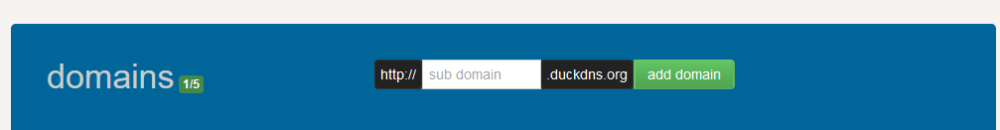



# Introduction
After buying my storage drives and setting up my TrueNAS Scale installation many months ago with Immich and some other containers I ran into the issue that is familiar to many who have done the same. How do I get rid of the security warnings? AKA, how do I set-up the SLL certificates and make all my apps use HTTPS? And how do I have the fancy subdomains for free without buying a new domain name by using DuckDNS?

In this guide I will be teaching you how I did the following:
* Set-up Nginx Proxy Manager on TrueNAS Scale ElectricEel-24.10.1
* How I configured Nginx so that ```https://immich.mysite.duckdns.org``` points to my local server immich installation on ```192.168.68.119:30045```
* And how I configured the rest of my containers that have web UIs so that ```https://name.mysite.duckdns.org``` pointed to their local address and port.

**Note:** I did not open my server to the public and did any port forwarding because I do not have any specific reason to do so and I didn't want to worry about keeping it safe. Instead I just set-up [Tailscale](https://tailscale.com/) so all my personal devices are able to see my server.

# Before Starting
1. You will need to create a [DuckDNS account](https://www.duckdns.org/) and you will need to add a domain. For the IP Address I used my server's local address ```192.168.68.115```.



2. Make sure all your applications are already set-up and running correctly when you open them with their local address like ```http://192.168.68.115:30045```.

# Changing the TrueNAS Scale WebUI ports
As Nginx will be redirecting all traffic from ports 80 and 443 we will first need to change the ports used for the TrueNAS Scale web interface so we can still access it. I set mine to port 81 for http and port 444 for https by just adding one to both numbers, but feel free to set it to whatever numbers you'd like.


After saving and reloading check to make sure you can access the TrueNAS Scale web interface through the new ports before continuing.

# Installing Nginx Proxy Manager
Now we'll install the Nginx Proxy Manager using the regular "Discover Apps" process in TrueNAS Scale.


Then search for Nginx and install it


As Nginx needs to run as root use the following settings for User and Group Configuration:
* User ID: 0
* Group ID: 0

For network configuration specify any port you want for WebUI Port and then set
* HTTP Port: 80
* HTTPS Port: 443


For storage configuration I created a **generic dataset** for the data storage and the certs storage.


And then set them as the "Host Paths" in the configuration.


# Configuring Nginx Proxy Manager
Now open the WebUI for Nginx at the port you specified in the configuration.

The username is **admin@example.com** and the password is **changeme**. After you login you will be forced to change your password.


I will now show you the process to set-up a single application that is not Immich, and then what extra steps need to be done for Immich to work properly.

For the example I will be setting up Nginx so my Dashy WebUI at ```192.168.68.115:31003``` can be accessed through ```dashy.mydomain.duckdns.org```.

Go to Hosts->Proxy Hosts and then Add Proxy Host.


For the **Details** section I set the configuration based on my local Dashy installation.
* Scheme - http or https depending on what you use when you access it directly through the local address and port. For Dashy I set it to **https** as I access Dashy through ```https://192.168.68.115:31003``` normally.
* Forward Hostname / IP - The local IP of my server.
* Forward Port - The port that the Dashy WebUI is configured to use.


For the **SSL** section:
* Request a new SSL Certificate
* Use a DNS Challenge
* DNS Provider - DuckDNS
* Then set dns_duckdns_token=**YOUR TOKEN**

Your token can be found in the [DuckDNS Website](https://www.duckdns.org) after logging in. Be sure to refresh the page and log-in again if it's been a while since you opened the page so that you can get your new updated token.


Lastly put one of your email addresses and click save. It might take a while but it should run succesfully. If it works correctly, the status should say **Online**.


Now if you go to ```https://dashy.mysite.duckdns.org``` you should see your Dashy WebUI.

You can repeat this for any amount of apps that you want.

# Extra Steps for Immich
Immich requires some extra configuration as detailed in their [guide](https://immich.app/docs/administration/reverse-proxy/).

I will show you exactly what I did to make mine work.

You will follow the same steps as before, but after setting up the **SSL** details you will go to **Advanced** and paste this after modifying it with your own server IP address and port. In my case, my installation of Immich is at ```http://192.168.68.115:30041``` so I set ```proxy_pass http://192.168.68.115:30041```.

```
client_max_body_size 50000M;

location / {

proxy_pass http://<YOUR-LOCAL-SERVER-IP-ADDRESS>:<YOUR IMMICH PORT>;

proxy_set_header Host $http_host;

proxy_set_header X-Real-IP $remote_addr;

proxy_set_header X-Forwarded-For $proxy_add_x_forwarded_for;

proxy_set_header X-Forwarded-Proto $scheme;

# http://nginx.org/en/docs/http/websocket.html

proxy_http_version 1.1;

proxy_set_header Upgrade $http_upgrade;

proxy_set_header Connection "upgrade";

proxy_redirect off;

} 

```


# Conclusion
I must admit that it took me a while to figure out how to get this to work when it's surprisingly simple. I gave up multiple times over the months before figuring it out earlier today. Hopefully you learned a thing or two and were able to get it to work for your own setup!

If you found it particularly useful you can consider supporting me by sending a small donation through Ko-fi.

<script src='https://storage.ko-fi.com/cdn/scripts/overlay-widget.js'></script>
<script>
  kofiWidgetOverlay.draw('developerjose', {
    'type': 'floating-chat',
    'floating-chat.donateButton.text': 'Support me',
    'floating-chat.donateButton.background-color': '#00b9fe',
    'floating-chat.donateButton.text-color': '#fff'
  });
</script>

------